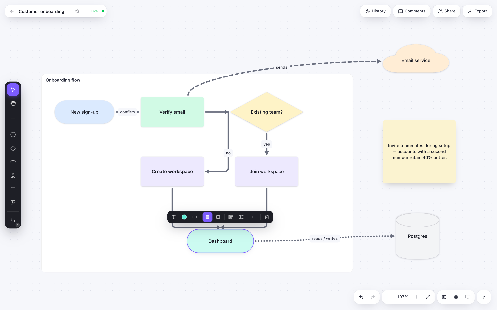
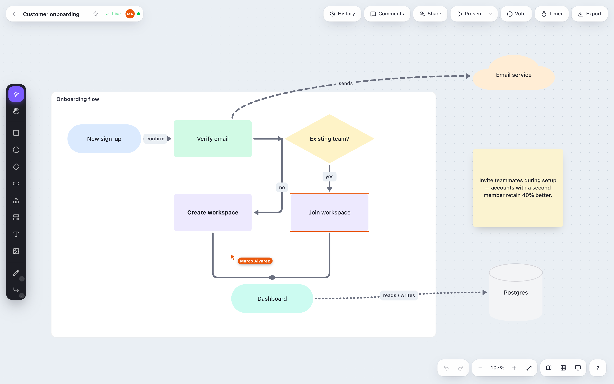
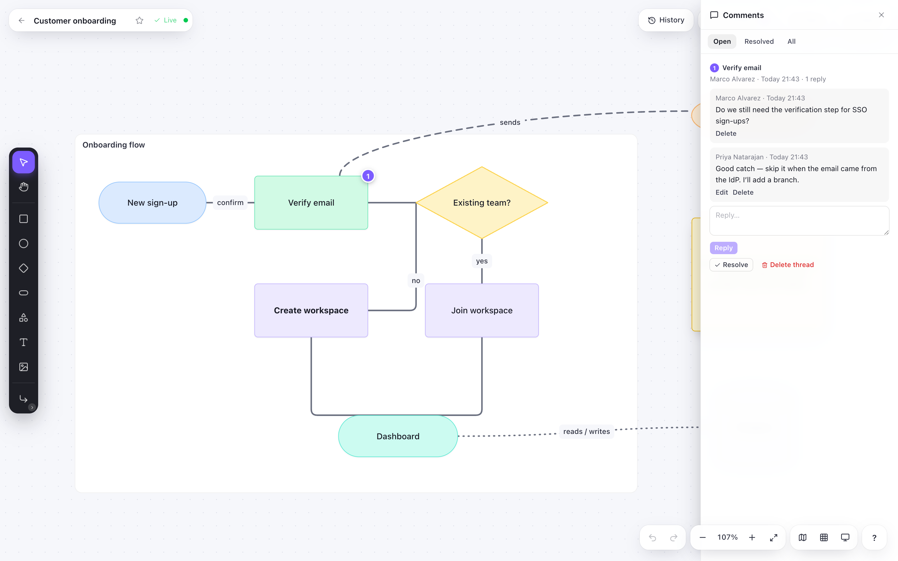
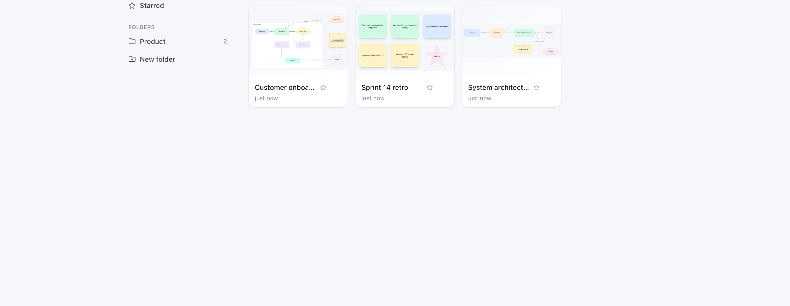

# FlowSketch

A full-featured, collaborative diagramming app inspired by Whimsical, built with React Flow, Zustand, Yjs and Tailwind CSS. Draw flowcharts and diagrams with a clean interface, share them with a link or invite teammates, and edit together in real time.



## Features

### Shapes
- **15 shape types** — Rectangle, Pill, Diamond, Hexagon, Cylinder, Ellipse, Triangle, Parallelogram, Document, Cloud, Star, Callout, Arrow, Sticky Note, Text
- Drag-and-drop from the left toolbar to add shapes; the ones without a keystroke live behind its **More shapes** menu
- Change a shape into another kind from the floating toolbar's **Shape** button — the label, size and colors stay put
- Resize any shape by dragging selection handles
- Smart alignment guides that snap to neighboring shapes while dragging
- **Groups** — select two or more shapes and press `⌘G` to make them move as one. A group draws nothing of its own: a dashed outline when you point at it or select it, and nothing at all otherwise, so it never appears in an export. Groups nest, deleting one deletes what is inside it, and copying one copies its contents. `⌘⇧G` lets them go again

### Connectors
- **Elbow (Manhattan) routing** with automatic obstacle avoidance
- **Straight connectors** for direct point-to-point lines
- **Curved connectors** that leave each shape square to the side they attach to
- Three line styles: solid, dashed, dotted
- Three line thicknesses: thin, regular, bold — arrowheads scale to match
- Five arrowhead styles per end: none, arrow, open, circle, diamond
- Editable connector labels (double-click a connector, use the toolbar's Add label button, or press Enter)
- Draggable bend points — drag a segment to add one, double-click a bend to remove it — and a Reset route button to clear them all
- Free-standing arrows that can be placed and dragged anywhere

### Text & Formatting
- Double-click any shape to edit text inline
- Multi-line text support
- **Bold**, *italic*, <u>underline</u> and ~~strikethrough~~
- Font size on a 10–48 px scale, stepped from the toolbar or with ⌘⌥= / ⌘⌥−
- Text alignment (left, center, right) and vertical alignment (top, middle, bottom)
- Auto-contrast text color on dark backgrounds, or pick the label's color yourself
- Labels stay inside the shape they belong to — a star's points and an arrow's head are not text

### Colors
- 28-color palette with quick-access swatches
- Independent fill and stroke color for each shape
- Works across all shape types including SVG-based shapes
- Per-shape corner radius, opacity and drop shadow behind the toolbar's Style button

### Canvas
- Infinite pan and zoom canvas
- **Frames** — draw a titled section with `F` (or the rail's **More shapes** menu) and drop shapes into it: anything dropped inside becomes part of the frame and travels with it, anything dragged out stops belonging to it. Double-click the title to rename it, drag its edges to resize, and nest frames inside frames. Unlike a group, a frame is part of the drawing and appears in exports
- Undo / redo history
- Export to PNG
- Copy, cut, paste, and duplicate selected shapes and connectors (`⌘C` / `⌘X` / `⌘V` / `⌘D`, or `⌥`-drag to duplicate)
- Lock / unlock shapes (`⌘⇧L`)
- Z-order controls: bring forward / backward, bring to front / send to back
- Copy / paste style between shapes and save a shape's fill & stroke as the default style for new shapes (`⌘⌥C`, `⌘⌥V`, `⌘⇧D`)
- Paste images from the clipboard as image shapes (`⌘V` with an image on the clipboard)
- Add hyperlinks to shapes from the floating toolbar
- Nudge selected shapes with the arrow keys (1 px, 10 px with Shift)
- Quick-add neighbor buttons on hover that create a connected shape in any direction
- Drag connector endpoints to reconnect them to other shapes
- Drag connector labels along the path to reposition them
- Right-click a shape, a connector or the canvas for a context menu of the actions that apply
- Find shapes and connectors by their labels with `⌘F`: every match is ringed on the board, `Enter` / `⇧Enter` cycle through them, and each one is selected and framed as you reach it. Available on read-only and publicly shared boards too
- Press `?` for a cheat sheet of every keyboard shortcut, generated from the command registry
- Minimap overview of the whole board, toggled from the bottom bar and remembered per browser
- Optional 10 px grid snapping, toggled from the bottom bar; the shape-to-shape alignment guides keep working either way
- Light and dark themes, cycled from the bottom bar (system → light → dark) and remembered per browser. It ships following your OS, and only the app's own chrome changes: shapes, connectors and their labels keep the colours you gave them, and an exported PNG or SVG is captured light whichever theme you are working in
- Auto-save to server (diagrams persist across sessions), including the pan and zoom the diagram was left at

### Dashboard
- **Folders** — file your diagrams into folders from the sidebar: **New folder** names one in place, and a card's ⋯ menu offers **Move to…** (or drag the card onto a folder). Selecting a folder filters the grid, and search and sort still apply inside it. Rename a folder in place from its ⋯ menu; deleting one asks first and keeps every diagram in it — they move back to **All diagrams**. Folders are personal: a diagram somebody shared with you is never in one of yours, and yours are never visible to anyone you share with. The sidebar collapses to a **Toggle folders** button on narrow screens
- **All diagrams / Starred** — the two standing views above your folders. Starred diagrams are also pinned to the front of every grid, whatever the sort
- Search by title and sort by last edited, title or creation date, within whatever the sidebar has selected
- Import a diagram from an exported JSON file, and duplicate, rename, star or delete one from its card

### Collaboration
- **Live editing** — two people on the same diagram edit it at once and both boards stay the same. Each of you drags your own shape, types your own label and deletes your own connector, and the changes merge as they happen: no reload, no "changed in another tab", no version of the board quietly winning. It works because the open diagram lives in a [Yjs](https://yjs.dev) document (a CRDT — concurrent edits from different people merge without a conflict to resolve) held by a self-hosted [Hocuspocus](https://tiptap.dev/docs/hocuspocus) server inside the same Express process, on the same port and the same session cookie. The JSON everything else reads — the dashboard, exports, version history, the public link — is re-rendered from that document as you go, so nothing else had to change. A diagram is upgraded the first time somebody opens it and never before; nothing is migrated in bulk.
- **Undo is yours** — `⌘Z` takes back what *you* did and never what somebody else did, however recently they did it. It reaches back through your own edits past theirs, and it undoes on their screen too, because taking an edit back is itself an edit. A drag is one step, a burst of arrow-key nudges is one step, and whatever comes back is selected so you can see what moved.
- **Live, or honest about not being** — where the save indicator used to say "Saved" it now says **Live**, because for a diagram this is what there is to know: there is no save to wait for, the document *is* the save. Lose the connection and it says **Reconnecting…**, then **Offline — changes will sync when you're back**, which is a promise a CRDT can keep: keep drawing, and what you drew merges in when the socket does. A diagram whose socket never opened at all — no session, a proxy that will not upgrade — keeps the old autosave, "Saved" and all.
- **Works offline, syncs when you're back** — the diagram you have open is kept in your own browser as well as on the server, so losing the connection costs you nothing: keep drawing, close the tab, reload the page with the network still down, and the board is there with everything you did on it. When the connection returns, your edits and everybody else's merge — nobody's copy wins and nothing is asked of you. A diagram you are no longer invited to is dropped from the browser along with your access to it.
- **Signing back in without losing the board** — if your session expires while a diagram is open, you get a sign-in box over the canvas instead of a bounce to the login page. Sign in and the connection is re-made underneath you, with everything drawn in the meantime still on screen and on its way to everyone else.
- **Live presence** — open a diagram somebody else has open and you see each other: their pointer moves across the board with their name on it, the shape they are holding is outlined in their colour, and everyone in the room has an avatar in the top bar next to a dot saying whether you are still connected. Everyone keeps the same colour everywhere, so the cursor, the outline and the avatar always agree. Cursors are chrome, not drawing — they never appear in an exported PNG or SVG. Viewers are in the room too; the public `/s/<token>` page is not, since there is nobody there to name.
- **Share link** — turn on "Anyone with the link can view" from the **Share** button and hand out a `/s/<token>` URL. It opens the board for anyone, signed in or not, with no way to change it. Turning the link off kills that URL for good; turning sharing back on mints a new one.
- **Invite people by email** — invite an existing account as **Can view** or **Can edit**, change someone's role, or remove them, all from the same dialog. Editors draw on the board exactly as the owner does; viewers read it. Only the owner can rename, duplicate, delete or star a diagram.
- **Shared with me** — diagrams other people have invited you to sit in their own section of the dashboard, with the owner's name and your role on each card, and have their own entry in the folder sidebar. Search and sort apply within each section. They are never filed into your folders: filing is the owner's, and only for what they own.
- **View only** — a viewer (and anyone on a share link) gets the board without the shape rail, the selection toolbar or the editing shortcuts, and a "View only" pill where the save indicator normally sits. Nothing they do can write to the diagram.
- **Comments** — right-click a shape or the canvas and pick **Comment** to pin a conversation to it. A numbered pin marks each open thread on the board and follows the shape it is on; clicking it opens the **Comments** sheet on that thread, where anyone with access can reply. Filter by Open / Resolved / All, resolve a thread to take its pin off the board, and reopen it later. Commenting is a viewer's right too — a reviewer who cannot write anything down is not reviewing — though only editors, and whoever opened a thread, can call it settled. Pins are chrome, not drawing: they never appear in an exported PNG or SVG.
- **Version history** — the **History** button lists what the diagram has been, newest first ("Today 14:03 · Ada · Before restore"). A version is kept for each burst of editing rather than for each autosave, and you can take a labelled snapshot at any time. Preview any version in place, then restore it — what it replaces is snapshotted first, so a restore is itself undoable.

### Collaboration-Ready Backend
- User authentication with email/password (BetterAuth)
- Email verification via configurable SMTP
- Per-user diagram dashboard
- RESTful API for diagram CRUD, folders, sharing, members, versions and comments

## More screenshots

**Editing together.** A teammate's cursor and selection show up live, and everyone on the board is in the presence strip.



**Comments pinned to shapes.** Threads live where the conversation happened; the panel filters open and resolved ones.



**The dashboard.** Thumbnails, folders, starring and search across all your diagrams.



## Keyboard shortcuts

On Windows and Linux use Ctrl for ⌘ and Alt for ⌥.

### Tools

| Shortcut | Tool |
|----------|------|
| `V` | Select |
| `H` | Pan |
| `R` | Rectangle |
| `O` | Ellipse |
| `D` | Diamond |
| `U` | Pill |
| `P` | Parallelogram |
| `G` | Triangle |
| `X` | Hexagon |
| `Y` | Cylinder |
| `S` / `N` | Sticky note |
| `T` | Text |
| `F` / `.` | Frame |
| `C` / `A` / `L` | Connector |
| `K` | Add a link to the selected shape |

Pressing a tool key switches to that tool; clicking or dragging on the canvas then places the shape.

### Editing

| Shortcut | Action |
|----------|--------|
| `Enter` | Edit the selected shape's text (or the selected connector's label) |
| `Escape` | Cancel / deselect and return to the Select tool |
| Double-click a shape | Edit its text inline |
| Double-click a connector label | Edit the label |
| Double-click empty canvas | Add a text shape and edit it |
| Right-click | Open the context menu for the shape, connector or canvas under the pointer |
| `Backspace` / `Delete` | Delete the selection |

### Selection & arrangement

| Shortcut | Action |
|----------|--------|
| `⌘A` | Select all shapes and connectors (locked shapes stay unselected) |
| `←` `↑` `→` `↓` | Nudge selection by 1 px |
| `⇧` + arrows | Nudge selection by 10 px |
| `]` | Bring selection to front |
| `[` | Send selection to back |
| `⌘]` | Bring selection forward |
| `⌘[` | Send selection backward |
| `⌘G` | Group the selection (needs 2 shapes) |
| `⌘⇧G` | Ungroup the selected group(s) |
| `⌘⇧L` | Lock / unlock selection |
| `⌥⇧` + arrows | Align the selection left / right / top / bottom (needs 2 shapes) |
| `⌥⇧H` / `⌥⇧V` | Align the selection on its horizontal / vertical centre line |
| `⌘⌥⇧H` / `⌘⌥⇧V` | Distribute the selection horizontally / vertically (needs 3 shapes) |

### Clipboard & style

| Shortcut | Action |
|----------|--------|
| `⌘C` | Copy the selection |
| `⌘X` | Cut the selection |
| `⌘V` | Paste the selection |
| `⌘D` | Duplicate the selection (offset +30) |
| `⌥`-drag | Duplicate a shape in place while dragging |
| `⌘⌥C` | Copy the selected shape's style |
| `⌘⌥V` | Paste style onto the selection |
| `⌘⇧D` | Save the selected shape's fill/stroke as the default style for new shapes |
| `⌘⌥=` | Increase font size of the selection |
| `⌘⌥-` | Decrease font size of the selection |
| `⌘⇧C` | Copy the canvas as an image to the clipboard |

### View

| Shortcut | Action |
|----------|--------|
| `⌘Z` | Undo |
| `⌘⇧Z` | Redo |
| `⌘=` / `⌘+` | Zoom in |
| `⌘-` | Zoom out |
| `=` / `+` | Zoom in |
| `-` | Zoom out |
| `0` | Reset zoom to 100% |
| `1` | Fit all shapes in view |
| `2` | Zoom to the selection |
| `⌘0` | Fit all shapes in view |
| `⌘F` | Find shapes and connectors by label; `Enter` / `⇧Enter` step through the matches, `Esc` closes |
| `Space` (hold) | Temporarily pan; releases back to the previous tool |
| `?` | Show the keyboard shortcut cheat sheet |

The minimap, grid snapping and the theme are commands too, but deliberately keyless — the letters
left are worth more to a tool — so they are reached from the bottom bar rather than the keyboard.

Every shortcut above is a single entry in the command registry (`src/commands/`), which also
generates the cheat sheet and the right-click menus — so this table, the tooltips and the app
cannot drift apart.

## Tech Stack

| Layer | Technology |
|-------|-----------|
| UI Framework | React 19, TypeScript |
| Diagram Engine | React Flow (@xyflow/react) |
| State Management | Zustand |
| Styling | Tailwind CSS v4 |
| Backend | Express 5, Node.js |
| Database | PostgreSQL + Prisma ORM |
| Authentication | BetterAuth |
| Build Tool | Vite 8 |

## Getting Started

### Prerequisites

- Node.js 20+
- PostgreSQL 15+
- (Optional) MailDev or any SMTP server for email verification

### Setup

1. **Clone and install**
   ```bash
   git clone https://github.com/piper5ul/flowsketch.git
   cd flowsketch
   npm install --legacy-peer-deps
   ```
   (`--legacy-peer-deps` works around an npm 10.9 resolver crash with this dependency set.)

2. **Start Postgres and MailDev**
   ```bash
   docker compose up -d
   ```
   Or point `.env` at your own Postgres 15+ and any SMTP server.

3. **Configure environment**
   ```bash
   cp .env.example .env
   ```
   The defaults match `docker-compose.yml`. Set `BETTER_AUTH_SECRET` to a random string:
   ```
   DATABASE_URL=postgresql://postgres@localhost:5432/flowsketch
   BETTER_AUTH_SECRET=your-random-secret-here
   BETTER_AUTH_URL=http://localhost:5199
   SMTP_HOST=localhost
   SMTP_PORT=1025
   PORT=3001
   ```

4. **Set up the database**
   ```bash
   npx prisma db push
   ```

5. **Start the dev server**
   ```bash
   npm run dev
   ```
   This starts both the Vite frontend (port 5199) and the Express API server (port 3001) concurrently.

6. **Open** [http://localhost:5199](http://localhost:5199)

Verification and password-reset emails land in MailDev at [http://localhost:1080](http://localhost:1080). Email verification is not required to sign in.

## Testing

```bash
npm run check      # lint + typecheck + unit tests (also runs as a pre-commit hook)
npm test           # Vitest: geometry, router, store, API routes — no database needed
npm run test:e2e   # Playwright against the running app: sign-up, draw, edit, autosave, reload
```

CI runs all of the above on every pull request, with Playwright against a fresh Postgres. See [CONTRIBUTING.md](CONTRIBUTING.md) for where to put new tests and the branch/PR workflow.

## Project Structure

```
flowsketch/
├── src/
│   ├── components/      # Canvas, toolbars, color palette, alignment guides
│   ├── edges/           # Custom connector edge + its arrowhead marker defs
│   ├── lib/             # Edge geometry, Manhattan router, shape outlines, color utilities
│   ├── nodes/           # Custom shape node with 15 shape types
│   ├── pages/           # Dashboard, canvas, shared (/s/:token), login, signup pages
│   ├── store/           # Zustand diagram store
│   └── types.ts         # Shared TypeScript types
├── server/              # Express API server + BetterAuth (+ router.test.ts)
├── e2e/                 # Playwright end-to-end tests
├── prisma/              # Database schema
├── shared/              # Types shared between client and server
└── public/              # Static assets
```

Unit tests live next to the code they cover (`src/lib/*.test.ts`, `src/store/*.test.ts`).

## Scripts

| Command | Description |
|---------|-------------|
| `npm run dev` | Start frontend + backend concurrently |
| `npm run dev:client` | Start Vite dev server only |
| `npm run dev:server` | Start Express server only |
| `npm run build` | Type-check and build for production |
| `npm run db:push` | Push Prisma schema to database |
| `npm run db:studio` | Open Prisma Studio GUI |
| `npm run lint` | Run oxlint |
| `npm run typecheck` | `tsc -b` across app, server, and tests |
| `npm test` | Unit tests (Vitest) |
| `npm run test:e2e` | End-to-end tests (Playwright) |
| `npm run check` | Lint + typecheck + unit tests |

## License

MIT
